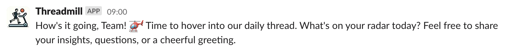
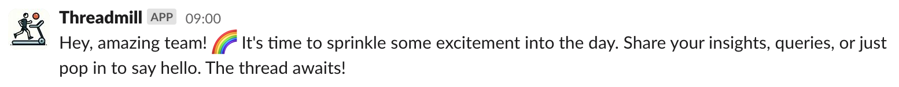
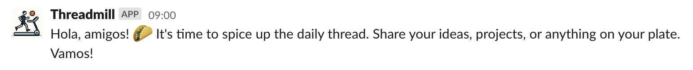

# Threadmill — a Slack bot that knows how to start a daily thread

Having a scheduled "Daily thread" message is boring.

Letting a team member start it is an unnecessary waste of human resources.

Using AI here is just right.

## How to

1. Create a Slack app [here](https://api.slack.com/apps/): I prefer to call it **Threadmill**, set `#15616d` as a background color, and use the [icon from the assets folder](https://github.com/Smileek/threadmill/blob/main/assets/icon.jpeg), but it's up to you.
2. Grant it `chat:write` and `chat:write.public` permissions on the "OAuth & Permissions" tab.
3. Install it to your workspace. Copy the "Bot User OAuth Token" into the `THREADMILL_SLACK_BOT_KEY` variable in your `.env` file (just in case: you need to make a copy of a `.env.example` file and rename it to `.env`).
4. It's a good idea to invite the bot to a channel you need it in. Simply mention the bot (it will probably be `@threadmill`) and send a message, or use the "Integrations" tab in the channel settings.
5. Fill in the `ADMIN_SLACK_ID` env variable if you want to be notified about errors on Slack. You can get it by clicking "Copy member ID" in the three-dot menu in your Slack profile.
6. Fill in `OPENAI_API_KEY` (you can get it [here](https://platform.openai.com/api-keys))
7. Set up this node.js application (you'll have to figure this out yourself, it's too much for this readme to explain. You can pay a few bucks and use something like glitch.com if you don't want to set it up yourself).
8. Find the ID of the channel you want the bot to post the daily messages: it'll be in the channel settings, at the bottom of the "About" tab.
9. Trigger `https://%YOUR_ADDRESS%[:%PORT%]/start_thread/%CHANNEL_ID%` (you can also use `before` and `after` query params if you need to add some static text—e.g., the team name). If everything is correct, you'll see a message in your thread.
10. Set up a cron job that triggers your endpoint. If you don't have a cron of your own, you can use <https://cron-job.org> (it's free if used responsibly).

## You'll get something like that

## Use it however you want

This project is distributed "as is", without any warranties or guarantees of any kind. It is provided freely, and anyone is permitted to use, modify, and distribute it for both personal and commercial purposes without restriction.
